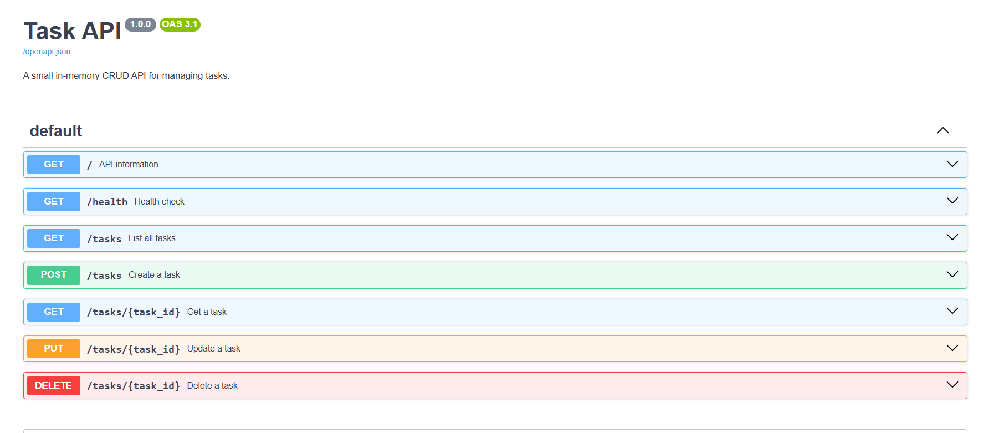
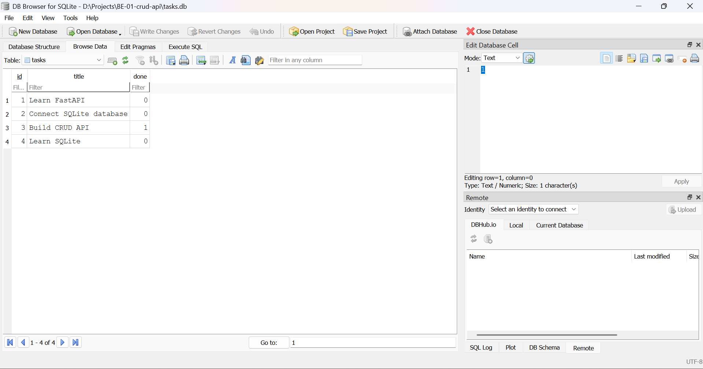

# Task API

A simple CRUD API built with Python and FastAPI for the FlyRank Backend AI Engineering BE-01 assignment.

## Features

* Create tasks
* Read all tasks
* Read a single task
* Update tasks
* Delete tasks
* SQLite database persistence
* Automatic database and table creation
* Input validation
* Correct HTTP status codes
* Interactive Swagger UI
* Persistent data across server restarts

## Tech Stack

* Python 3
* FastAPI
* Uvicorn
* Pydantic
* SQLite
* Swagger UI / OpenAPI
* Git and GitHub

## Installation

Clone the repository:

```bash
git clone https://github.com/Plabon-Basak/be-01-crud-api
cd be-01-crud-api
```

Create a virtual environment:

```bash
python -m venv .venv
```

Activate it on Windows:

```bash
.venv\Scripts\activate
```

Install dependencies:

```bash
pip install -r requirements.txt
```

## Run

Start the API:

```bash
uvicorn main:app --reload
```

The API will be available at:

```text
http://localhost:8000
```

Swagger UI:

```text
http://localhost:8000/docs
```

## Database

This version of the API uses SQLite for persistent data storage.

The database file is:

```text
tasks.db
```

The database and `tasks` table are created automatically when the application starts.

### Tasks Table

| Column  | Type    | Description            |
| ------- | ------- | ---------------------- |
| `id`    | INTEGER | Unique task ID         |
| `title` | TEXT    | Task title             |
| `done`  | BOOLEAN | Task completion status |

If the `tasks` table is empty, the application inserts three example tasks automatically.

## Endpoints

| Method | Endpoint      | Description     | Success |
| ------ | ------------- | --------------- | ------- |
| GET    | `/`           | API information | 200     |
| GET    | `/health`     | Health check    | 200     |
| GET    | `/tasks`      | Get all tasks   | 200     |
| GET    | `/tasks/{id}` | Get one task    | 200     |
| POST   | `/tasks`      | Create a task   | 201     |
| PUT    | `/tasks/{id}` | Update a task   | 200     |
| DELETE | `/tasks/{id}` | Delete a task   | 204     |

## Error Handling

| Status | Meaning              |
| ------ | -------------------- |
| 400    | Invalid request data |
| 404    | Task not found       |

## Example Request

Create a task:

```bash
curl -i -X POST http://localhost:8000/tasks -H "Content-Type: application/json" -d "{\"title\":\"Buy milk\"}"
```

Example response:

```json
{
  "id": 4,
  "title": "Buy milk",
  "done": false
}
```

## Example SQL Query

The SQLite database can be inspected using a SQLite database viewer such as DB Browser for SQLite.

Example query:

```sql
SELECT * FROM tasks;
```

Other useful queries:

```sql
SELECT * FROM tasks WHERE done = 1;
```

```sql
SELECT COUNT(*) FROM tasks;
```

## Swagger UI

The API documentation is available through FastAPI's built-in Swagger UI.



## Database Screenshot

The SQLite database can be viewed using a SQLite database viewer.

Add your database screenshot here:



## Data Persistence

Unlike the original in-memory version, this version stores tasks in SQLite.

Therefore, tasks remain available after the API server is stopped and restarted.

The `tasks.db` file is excluded from Git using `.gitignore` because it is generated locally by the application.

## Project Structure

```text
BE-01-crud-api/
├── .gitignore
├── database.py
├── main.py
├── requirements.txt
├── README.md
└── screenshots/
    ├── swagger.png
    └── database.png
```

## Assignment

FlyRank Backend AI Engineering — BE-01: Build your first CRUD API with SQLite database persistence.
